# Zipper Service

Zipper is a service that allows [Sources][source] and [StreamFunctions][sfn] connect.
It is responsible for forwarding data between [Source][source] and [StreamFunction][sfn].

```mermaid
sequenceDiagram
  participant Source as Source 🏌🏻‍♀️
  participant Zipper as Zipper 🚦
  participant StreamFunction as StreamFunction 🏋🏼‍♀️

  StreamFunction--)Zipper: "Observe<tag=0x03>"
  Source->>Zipper: "Data:{tag: 0x03, payload: "hello world"}"
  Zipper->>StreamFunction: "Data:{tag: 0x03, payload: "hello world"}"
```



Zipper expose a QUIC endpoint, as the QUIC server, while [Source][source] and [StreamFunction][sfn] are all QUIC clients.

## Zipper Cascading and Mesh Network

YoMo is designed as a decentralized system, Zippers can be connected to each other, and the data is forwarded to downstream Zippers when needed. Using this approach, we can build a large scale system, but developers do not need to care about the network topology; the data will be delivered to the nearest [StreamFunction](sfn), and, when needed, the data can also be delivered to  other [Zipper][zipper] nodes:

```mermaid
sequenceDiagram
  participant Source
  participant Zipper
  participant StreamFunction-1 as StreamFunction 🈂️
  participant StreamFunction-2 as StreamFunction 🤹🏻‍♀️

  Source->>Zipper: "Data:{tag: 0x03, payload: "Bonjour le monde"}"
  Zipper->>StreamFunction-1: "Data:{tag: 0x03, payload: "Hello world"}"
  StreamFunction-1-->>StreamFunction-2: "Data: {tag: 0x04, payload: "HELLO WORLD"}"
  StreamFunction-2-->>Zipper: "Data: {tag: 0x14, payload: "👋🏼🌍😋"}"
  Zipper-->>Source: "Data: {tag: 0x14, payload: "👋🏼🌍😋"}"
```



By this mechanism, developers can deploy their functions close to the data source for low-latency processing or privacy data handling, 
deploy other functions to regional data centers for general processing or GPU farm.

## Usage

Zipper can be started by the following command:

```bash
yomo serve -c config.yaml
```

the `config.yaml` is a YAML file, which contains the configuration of the Zipper:

```yaml
### general ###
name: america
host: 0.0.0.0
port: 9000

### auth ###
auth:
  type: token
  token: <CREDENTIAL>

### sfn ###
functions:
  - name: sfn-ai-stream-response
  - name: sfn-async-log-events

### cascading ###
downstreams:
   - zipper-asia_pacific
     host: 2.2.2.2
     port: 9000
     auth: 'token: <CREDENTIAL>'
   - zipper-america
     host: 3.3.3.3
     port: 9000
     auth: 'token: <CREDENTIAL>'
   - zipper-europe
     host: 4.4.4.4
     port: 9000
     auth: 'token: <CREDENTIAL>'
```

## Configuration

### General Config

- `name` - the name of the Zipper, it is used to identify the Zipper in the network.
- `host` - the IP address zipper listens on, default value is `0.0.0.0`, which means listen on all network interfaces, so the [Source][source] can connect over public Internet network, while the [StreamFunction][sfn] can connect over internal network, it will be cost effective when hosting on AWS etc.
- `port` - the port zipper listens on, default value is `9000`. Becareful, YoMo uses QUIC protocol, which is a UDP based protocol, so this port should be allow UDP ingress.

### Auth Config

- `auth` - provides the credential for the Zipper, it is used to authenticate the [Source][source] and [StreamFunction][sfn] when they connect to this Zipper.
  - `type` - the type of the credential, currently only `token` is supported.
  - `token` - the credential, it is a string.

### StreamFunction Config

- `functions` - the list of [StreamFunctions][sfn] that allowed to connect this Zipper.
  - `name` - the name of the [StreamFunction][sfn], it is used to identify the [StreamFunction][sfn] in the network.

### Downstreams Config

- `downstreams` - the list of downstream Zippers, the data will be forwarded to these Zippers when needed.
  - `name` - the name of the downstream Zipper, it is used to identify the Zipper in the network.
  - `host` - the IP address of the downstream Zipper.
  - `port` - the port of the downstream Zipper.
  - `auth` - the credential to connect to the downstream Zipper.

## Self-Hosting Zipper Service

- Tutorial: Deploy YoMo Zipper Service on Ubuntu 22.04
- Tutorial: Linux Server Tuning for QUIC
- Tutorial: Firewall Configuration for Server

[source]: ../api/source
[sfn]: ../api/sfn