# Zipper

Zipper is a service that allows [Sources][source] and [StreamFunctions][sfn] connect to.
It is responsible for forwarding data between [Source][source] and [StreamFunction][sfn].

```mermaid
sequenceDiagram
  participant Source as Source 🏌🏻‍♀️
  participant Zipper as Zipper 🚦
  participant StreamFunction as StreamFunction 🏋🏼‍♀️

  StreamFunction--)Zipper: "Observe<tag=0x03>"
  Source->>Zipper: "Data:{tag: 0x03, payload: "hello world"}"
  Zipper->>StreamFunction: "Data:{tag: 0x03, payload: "hello world"}"
```



Zipper expose a QUIC endpoint, as the QUIC server, while [Source][source] and [StreamFunction][sfn] are all QUIC clients.

## Zipper Cascading and Mesh Network

YoMo is designed as a decentralized system, Zippers can be connected to each other, and the data will be forwarded to downstram Zippers when needed. By this, we can build a large scale system, but developers do not need to care about the network topology, the data will be delivered to the nearest [StreamFunction](sfn), when needed, the data can be delivered to all other nodes:



```mermaid
sequenceDiagram
  participant Source
  participant Zipper
  participant StreamFunction-1 as StreamFunction 🈂️
  participant StreamFunction-2 as StreamFunction 🤹🏻‍♀️

  Source->>Zipper: "Data:{tag: 0x03, payload: "Bonjour le monde"}"
  Zipper->>StreamFunction-1: "Data:{tag: 0x03, payload: "Hello world"}"
  StreamFunction-1-->>StreamFunction-2: "Data: {tag: 0x04, payload: "HELLO WORLD"}"
  StreamFunction-2-->>Zipper: "Data: {tag: 0x14, payload: "👋🏼🌍😋"}"
  Zipper-->>Source: "Data: {tag: 0x14, payload: "👋🏼🌍😋"}"
```

By this mechanism, developers can deploy their functions close to the data source for low-latency processing or privacy data handling, 
deploy other functions to regional data centers for general processing or GPU farm.

## Usage

Zipper can be started by the following command:

```bash
yomo serve -c config.yaml
```

the `config.yaml` is a YAML file, which contains the configuration of the Zipper:

```yaml
### basic ###
name: america
host: 0.0.0.0
port: 9000

### auth ###
auth:
  type: token
  token: <CREDENTIAL>

### sfn ###
functions:
  - name: sfn-ai-stream-response
  - name: sfn-async-log-events

### cascading ###
downstreams:
   - zipper-asia_pacific
      host: 2.2.2.2
      port: 9000
   - zipper-america
      host: 3.3.3.3
      port: 9000
   - zipper-europe
      host: 4.4.4.4
      port: 9000
```

[source]: ../api/source
[sfn]: ../api/sfn