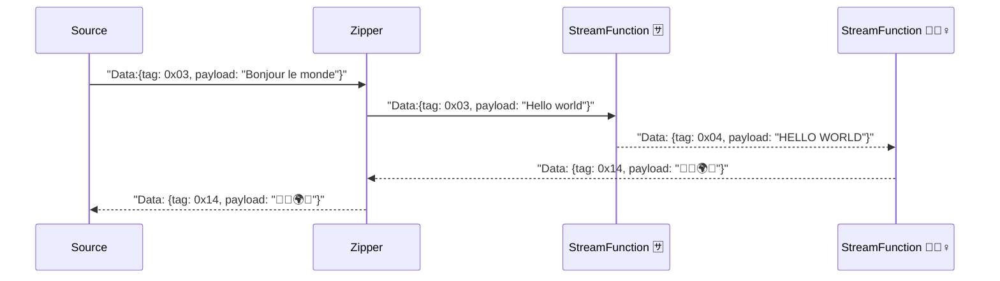

```mermaid
sequenceDiagram
  participant Source
  participant Zipper
  participant StreamFunction-1 as StreamFunction 🈂️
  participant StreamFunction-2 as StreamFunction 🤹🏻‍♀️

  Source->>Zipper: "Data:{tag: 0x03, payload: "Bonjour le monde"}"
  Zipper->>StreamFunction-1: "Data:{tag: 0x03, payload: "Hello world"}"
  StreamFunction-1-->>StreamFunction-2: "Data: {tag: 0x04, payload: "HELLO WORLD"}"
  StreamFunction-2-->>Zipper: "Data: {tag: 0x14, payload: "👋🏼🌍😋"}"
  Zipper-->>Source: "Data: {tag: 0x14, payload: "👋🏼🌍😋"}"
```
