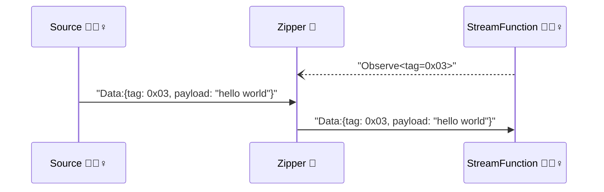

```mermaid
sequenceDiagram
  participant Source as Source 🏌🏻‍♀️
  participant Zipper as Zipper 🚦
  participant StreamFunction as StreamFunction 🏋🏼‍♀️

  StreamFunction--)Zipper: "Observe<tag=0x03>"
  Source->>Zipper: "Data:{tag: 0x03, payload: "hello world"}"
  Zipper->>StreamFunction: "Data:{tag: 0x03, payload: "hello world"}"
```
