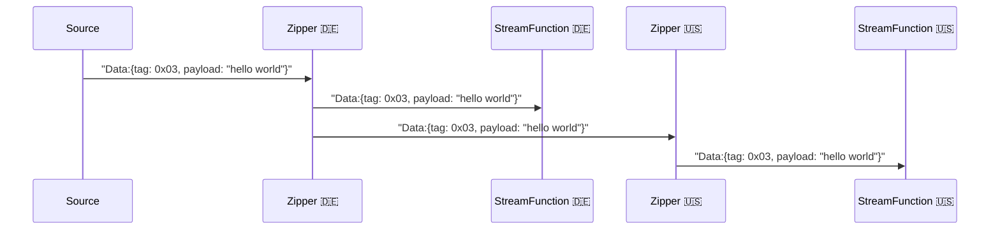

```mermaid
sequenceDiagram
  participant Source
  participant Zipper-1 as Zipper 🇩🇪
  participant StreamFunction-A as StreamFunction 🇩🇪
  participant Zipper-2 as Zipper 🇺🇸
  participant StreamFunction-B as StreamFunction 🇺🇸

  Source->>Zipper-1: "Data:{tag: 0x03, payload: "hello world"}"
  Zipper-1->>StreamFunction-A: "Data:{tag: 0x03, payload: "hello world"}"
  Zipper-1->>Zipper-2: "Data:{tag: 0x03, payload: "hello world"}"
  Zipper-2->>StreamFunction-B: "Data:{tag: 0x03, payload: "hello world"}"
```
