# Glossary of terms

YoMo's goal is provide an open source Software Edge Infra to help developers building their own [Geo-distributed System][geo-distributed-system].

Building an application that can be deployed on multiple Data Regions is not that easy, nowadays, more and more developers want to put thier services close to users. Response in low-latency, enhanced data privacy and security, distributed AI inference and more, give users beest experience.

To archieve this goal, YoMo provides a framework which consists of 3 parts:

```mermaid
sequenceDiagram
  participant Source as Source 🏌🏻‍♀️
  participant Zipper as Zipper 🚦
  participant StreamFunction as StreamFunction 🏋🏼‍♀️

  StreamFunction--)Zipper: "Observe<tag=0x03>"
  Source->>Zipper: "Data:{tag: 0x03, payload: "hello world"}"
  Zipper->>StreamFunction: "Data:{tag: 0x03, payload: "hello world"}"
```

- 🏌🏻‍♀️ [Source][source] - generate data, and send data to Zipper.
- 🚦 [Zipper][zipper] - forward data between Sources and StreamFunctions, and provide ability to connect to other Zipper nodes.
- 🏋🏼‍♀️ [StreamFunction][sfn] - process data and generate results.

## Source

Source is responsible for generating data, and send data to Zipper. [API Source][api-source] provides details about how to implement a Source.

## Zipper Service

Zipper is a service that allows [Sources][source] and [StreamFunctions][sfn] connect.
It is responsible for forwarding data between [Source][source] and [StreamFunction][sfn].

Zipper expose a QUIC endpoint, as the *QUIC server*, while [Source][source] and [StreamFunction][sfn] are all *QUIC clients*.

### Zipper Cascading and Mesh Network

YoMo is designed as a decentralized system, Zippers can be connected to each other, and the data is forwarded to downstream Zippers when needed. Using this approach, we can build a large scale system, but developers do not need to care about the network topology; the data will be delivered to the nearest [StreamFunction](sfn), and, when needed, the data can also be delivered to  other [Zipper][zipper] nodes.

By this mechanism, developers can deploy their functions close to the data source for low-latency processing or privacy data handling, 
deploy other functions to regional data centers for general processing or GPU farm.

```mermaid
sequenceDiagram
  participant Source
  participant Zipper-1 as Zipper 🇩🇪
  participant StreamFunction-A as StreamFunction 🇩🇪
  participant Zipper-2 as Zipper 🇺🇸
  participant StreamFunction-B as StreamFunction 🇺🇸

  Source->>Zipper-1: "Data:{tag: 0x03, payload: "hello world"}"
  Zipper-1->>StreamFunction-A: "Data:{tag: 0x03, payload: "hello world"}"
  Zipper-1->>Zipper-2: "Data:{tag: 0x03, payload: "hello world"}"
  Zipper-2->>StreamFunction-B: "Data:{tag: 0x03, payload: "hello world"}"
```

## StreamFunction

StreamFunction is **Stateful Serverless**, responsible for processing data and generating results. [API StreamFunction][api-sfn] provides details about how to implement a StreamFunction. 

Currently, YoMo support build StreamFunction as WebAssembly, this means developers can write their functions in any language that can be compiled to [WebAssembly](https://webassembly.org/), such as Rust, C, C++, Go, AssemblyScript, etc. 

A tutorial of how to build a StreamFunction in WebAssembly is available [here](/cli/sfn).

### Philosophy

Unix philosophy says a program should [Do One Thing and Do It Well](https://en.wikipedia.org/wiki/Unix_philosophy), we think the same for serverless. Developers can separate their functions into multiple StreamFunctions, and connect them together to build a complex system.

```mermaid
sequenceDiagram
  participant Source
  participant Zipper
  participant StreamFunction-1 as StreamFunction 🈂️
  participant StreamFunction-2 as StreamFunction 🤹🏻‍♀️

  Source->>Zipper: "Data:{tag: 0x03, payload: "Bonjour le monde"}"
  Zipper->>StreamFunction-1: "Data:{tag: 0x03, payload: "Hello world"}"
  StreamFunction-1-->>StreamFunction-2: "Data: {tag: 0x04, payload: "HELLO WORLD"}"
  StreamFunction-2-->>Zipper: "Data: {tag: 0x14, payload: "👋🏼🌍😋"}"
  Zipper-->>Source: "Data: {tag: 0x14, payload: "👋🏼🌍😋"}"
```

[geo-distributed-system]: /docs/concept-geo-distributed
[api-source]: /docs/api/source
[api-sfn]: /docs/api/sfn
[source]: #source
[sfn]: #sfn
[zipper]: #zipper